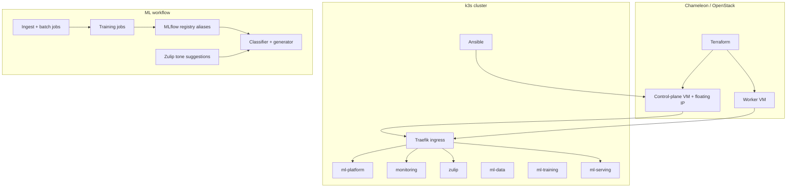

# Architecture

## High-level layout

## Infrastructure layers

| Layer | Responsibility | Location |
|-------|----------------|----------|
| Cloud provisioning | VM instances, floating IP, networking, security groups | `infra/terraform/openstack/` |
| Cluster bootstrap | k3s server, worker join, kubeconfig setup | `infra/ansible/playbooks/k3s_install.yml` |
| Platform | MLflow, MinIO, monitoring | `infra/ansible/playbooks/deploy_platform.yml`, `k8s/platform/` |
| Application | Zulip Helm deployment | `infra/ansible/playbooks/deploy_zulip.yml`, `k8s/zulip/` |
| ML workloads | data, training, inference, bridge | `infra/ansible/playbooks/deploy_ml_workloads.yml`, `k8s/data/`, `k8s/training/`, `k8s/inference/`, `k8s/integration/` |

## Runtime flow

1. User types a message in Zulip.
2. Zulip UI calls the custom tone-suggestion path.
3. The bridge in `ml-serving` forwards the message to the generator.
4. The generator calls the classifier and produces `formal`, `friendly`, and `neutral` suggestions.
5. Suggestions are returned to Zulip and shown in the compose area.

## Training and serving flow

1. Data jobs populate MinIO.
2. Training jobs read data from MinIO and log runs to MLflow.
3. The registry job assigns aliases such as `canary` and `prod`.
4. Serving deployments load models by MLflow alias.
5. The Zulip bridge always points at the production serving path.

## Design notes

- The control-plane is the public entry point and the SSH jump host for the worker.
- Stateful services use k3s `local-path` backed by a Chameleon block volume mounted at `/mnt/block/local-path-provisioner` on the control-plane.
- The current design improves persistence and recoverability across VM rebuilds by reattaching the same block volume, but it is not automatic multi-node HA storage.
- The generator serving path mounts a repo-controlled `model.py` through a ConfigMap so the cluster behavior can track the repo logic without waiting for a rebuilt image.
