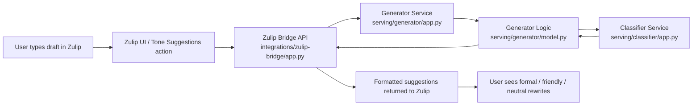
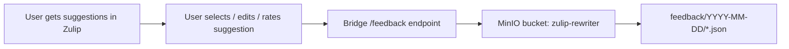
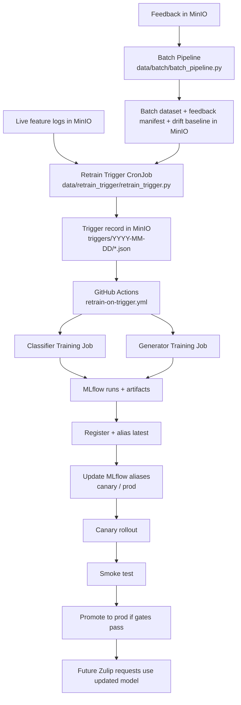
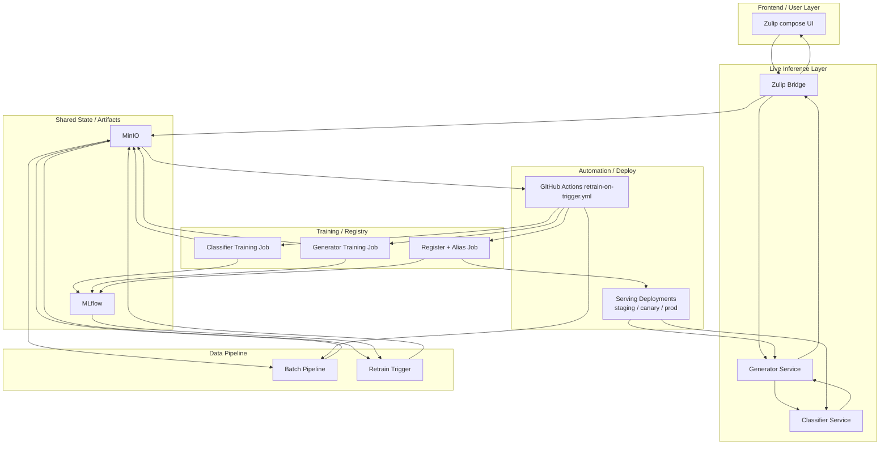

# Pipeline Walkthrough

This document explains the full working pipeline from a user typing a message in Zulip to live inference, feedback capture, retraining, registration, and serving rollout.

## 1. User Request Path

The live request path starts in Zulip. A user writes a draft and clicks `Tone suggestions`. The custom Zulip integration sends that draft to the Zulip bridge, which is the serving entry point for the ML system.

Primary files:

- [integrations/zulip-bridge/app.py](C:\Users\sudha\OneDrive\Desktop\MLOps\Multi-Tone-Communication-Assistant-for-Zulip---MLOps\integrations\zulip-bridge\app.py)
- [k8s/integration/zulip-bridge-deployment.yaml](C:\Users\sudha\OneDrive\Desktop\MLOps\Multi-Tone-Communication-Assistant-for-Zulip---MLOps\k8s\integration\zulip-bridge-deployment.yaml)
- [serving/generator/app.py](C:\Users\sudha\OneDrive\Desktop\MLOps\Multi-Tone-Communication-Assistant-for-Zulip---MLOps\serving\generator\app.py)
- [serving/generator/model.py](C:\Users\sudha\OneDrive\Desktop\MLOps\Multi-Tone-Communication-Assistant-for-Zulip---MLOps\serving\generator\model.py)
- [serving/classifier/app.py](C:\Users\sudha\OneDrive\Desktop\MLOps\Multi-Tone-Communication-Assistant-for-Zulip---MLOps\serving\classifier\app.py)

What happens in order:

1. The Zulip bridge validates the request and assigns a `message_id`.
2. The bridge sends the input text to the generator service.
3. The generator produces `formal`, `friendly`, and `neutral` rewrites.
4. The generator uses classifier-backed tone information and internal fallback logic to improve weak outputs.
5. The bridge formats the result into a Zulip-compatible response and returns it to the frontend.
6. The bridge writes a privacy-preserving feature log for the live request into MinIO under `feature_logs/YYYY-MM-DD/` so production drift can be monitored without storing raw message text.

## 2. How The Model Is Picked

The system does not use a single hardcoded model file. Serving uses MLflow-registered model versions behind aliases such as `canary` and `prod`.

Primary files:

- [k8s/training/register-bundle/job.yaml](C:\Users\sudha\OneDrive\Desktop\MLOps\Multi-Tone-Communication-Assistant-for-Zulip---MLOps\k8s\training\register-bundle\job.yaml)
- [k8s/training/register-bundle/scripts/register_and_alias_latest.py](C:\Users\sudha\OneDrive\Desktop\MLOps\Multi-Tone-Communication-Assistant-for-Zulip---MLOps\k8s\training\register-bundle\scripts\register_and_alias_latest.py)
- [k8s/inference/base/classifier-pytorch.yaml](C:\Users\sudha\OneDrive\Desktop\MLOps\Multi-Tone-Communication-Assistant-for-Zulip---MLOps\k8s\inference\base\classifier-pytorch.yaml)
- [k8s/inference/base/generator.yaml](C:\Users\sudha\OneDrive\Desktop\MLOps\Multi-Tone-Communication-Assistant-for-Zulip---MLOps\k8s\inference\base\generator.yaml)

Selection flow:

1. Training jobs log model runs and artifacts to MLflow and MinIO.
2. The registration job chooses the latest acceptable model versions.
3. It updates aliases like `canary` and `prod`.
4. Serving deployments use the alias-backed model version.
5. When the alias moves and the deployment rolls, live traffic uses the newer model.

## 3. Feedback Capture

After suggestions are shown, the user can effectively give feedback by selecting, editing, or rating a suggestion. That feedback is sent back to the bridge through `POST /feedback`.

Primary files:

- [integrations/zulip-bridge/app.py](C:\Users\sudha\OneDrive\Desktop\MLOps\Multi-Tone-Communication-Assistant-for-Zulip---MLOps\integrations\zulip-bridge\app.py)
- [k8s/integration/zulip-bridge-deployment.yaml](C:\Users\sudha\OneDrive\Desktop\MLOps\Multi-Tone-Communication-Assistant-for-Zulip---MLOps\k8s\integration\zulip-bridge-deployment.yaml)

Feedback fields include:

- `message_id`
- `tone_shown`
- `user_action`
- `correct_tone`
- `preferred_text`

Storage location:

- MinIO bucket: `zulip-rewriter`
- object prefix: `feedback/YYYY-MM-DD/`

In parallel with feedback capture, the bridge also writes live feature-only records for every request:

- MinIO bucket: `zulip-rewriter`
- object prefix: `feature_logs/YYYY-MM-DD/`

Each feature log stores only derived request features such as:

- `word_count`
- `char_count`
- `polite_marker_count`
- `informal_marker_count`
- `has_question_mark`
- `has_exclamation`
- `estimated_formality`

Operational note:

- The bridge exposes Prometheus metrics for feedback and feature-log activity.
- Grafana's `Data Monitoring and Quality` dashboard uses those bridge metrics together with job and pod-health signals from the cluster.

## 4. Batch Pipeline

The batch pipeline converts raw data, online activity, and user feedback into a new training dataset.

Primary files:

- [data/batch/batch_pipeline.py](C:\Users\sudha\OneDrive\Desktop\MLOps\Multi-Tone-Communication-Assistant-for-Zulip---MLOps\data\batch\batch_pipeline.py)
- [k8s/data/data-batch-job.yaml](C:\Users\sudha\OneDrive\Desktop\MLOps\Multi-Tone-Communication-Assistant-for-Zulip---MLOps\k8s\data\data-batch-job.yaml)
- [k8s/data/data-batch-configmap.yaml](C:\Users\sudha\OneDrive\Desktop\MLOps\Multi-Tone-Communication-Assistant-for-Zulip---MLOps\k8s\data\data-batch-configmap.yaml)

It writes versioned outputs such as:

- `batch/YYYY-MM-DD/feedback_manifest.json`
- `batch/YYYY-MM-DD/drift_baseline.json`
- `batch/v1_batch_YYYY-MM-DD/train.parquet`
- `batch/v1_batch_YYYY-MM-DD/test.parquet`
- `batch/v1_batch_YYYY-MM-DD/manifest.json`
- `batch/v1_batch_YYYY-MM-DD/drift_baseline.json`

Important behavior:

- `preferred_text` feedback rows are merged into the training set
- feedback summary statistics are computed
- a drift baseline is computed from the selected training corpus and stored in MinIO
- the batch result becomes the input for retraining

## 5. Retrain Trigger

Retraining is policy-driven, not immediate on every feedback event.

Primary files:

- [data/retrain_trigger/retrain_trigger.py](C:\Users\sudha\OneDrive\Desktop\MLOps\Multi-Tone-Communication-Assistant-for-Zulip---MLOps\data\retrain_trigger\retrain_trigger.py)
- [k8s/data/retrain-trigger-configmap.yaml](C:\Users\sudha\OneDrive\Desktop\MLOps\Multi-Tone-Communication-Assistant-for-Zulip---MLOps\k8s\data\retrain-trigger-configmap.yaml)
- [k8s/data/retrain-trigger-cronjob.yaml](C:\Users\sudha\OneDrive\Desktop\MLOps\Multi-Tone-Communication-Assistant-for-Zulip---MLOps\k8s\data\retrain-trigger-cronjob.yaml)

The trigger evaluates:

- new feedback count since last retrain
- feedback approval rate
- live production drift using `feature_logs/` versus the latest `drift_baseline.json`

If thresholds are met, it writes:

- `triggers/YYYY-MM-DD/trigger_<timestamp>.json`

Each trigger evaluation also writes a drift report to:

- `drift/evaluations/YYYY-MM-DD/drift_<timestamp>.json`

## 6. Retraining Automation

The main orchestration is handled by GitHub Actions.

Primary workflow:

- [.github/workflows/retrain-on-trigger.yml](C:\Users\sudha\OneDrive\Desktop\MLOps\Multi-Tone-Communication-Assistant-for-Zulip---MLOps\.github\workflows\retrain-on-trigger.yml)

The workflow:

1. looks for an unprocessed trigger record
2. reruns the batch pipeline
3. reruns classifier training
4. reruns generator training
5. waits for training completion
6. runs registration
7. rolls canary serving
8. smoke-tests canary
9. promotes to prod if gates pass
10. marks the trigger record as processed

## 7. Training And Registration

Training happens in Kubernetes jobs in `ml-training`.

Primary files:

- [k8s/training/classifier-training-job.yaml](C:\Users\sudha\OneDrive\Desktop\MLOps\Multi-Tone-Communication-Assistant-for-Zulip---MLOps\k8s\training\classifier-training-job.yaml)
- [k8s/training/generator-training-job.yaml](C:\Users\sudha\OneDrive\Desktop\MLOps\Multi-Tone-Communication-Assistant-for-Zulip---MLOps\k8s\training\generator-training-job.yaml)
- [k8s/training/register-bundle/job.yaml](C:\Users\sudha\OneDrive\Desktop\MLOps\Multi-Tone-Communication-Assistant-for-Zulip---MLOps\k8s\training\register-bundle\job.yaml)
- [k8s/training/register-bundle/scripts/register_and_alias_latest.py](C:\Users\sudha\OneDrive\Desktop\MLOps\Multi-Tone-Communication-Assistant-for-Zulip---MLOps\k8s\training\register-bundle\scripts\register_and_alias_latest.py)

Training jobs:

- read the latest batch dataset from MinIO
- train a new classifier and generator
- log metrics and artifacts to MLflow

The registration job:

- enforces quality gates
- creates new MLflow model versions
- updates serving aliases such as `canary` and `prod`

## 8. Full Closed Loop

## 9. Full System Architecture

## 10. One-Line Summary

The complete working loop is:

`User draft in Zulip -> bridge -> generator/classifier serving -> suggestions returned -> user feedback stored in MinIO -> batch pipeline builds new dataset -> retrain trigger writes trigger record -> GitHub Actions launches training -> MLflow registration updates aliases -> serving rollout uses the newer model`
