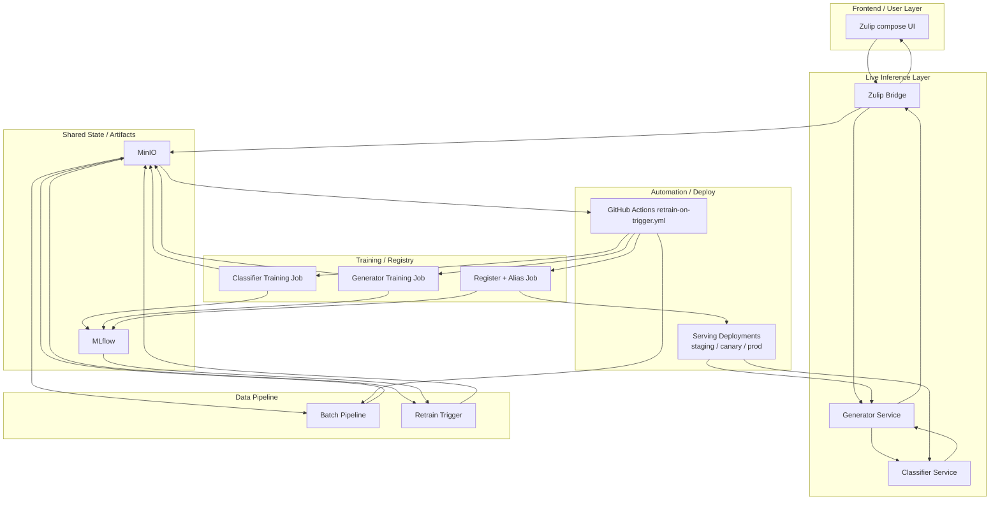

# Multi-Tone Communication Assistant for Zulip

This repository contains the infrastructure, Kubernetes manifests, training code, serving code, and Zulip integration needed to run the project end to end on Chameleon Cloud.

## What is in this repo

- OpenStack + networking provisioning with Terraform
- Two-node k3s cluster bootstrap with Ansible
- Shared platform services: MLflow, MinIO, Prometheus, Grafana
- Centralized runtime secrets through Sealed Secrets
- Scheduled backups from stateful services into Chameleon object storage
- Zulip deployment through the docker-zulip Helm chart
- Data, training, model registration, and serving workloads
- Zulip bridge and custom Zulip UI integration for tone suggestions

## Current architecture

- `control-plane` node: public floating IP, cluster admin operations, core platform access
- `worker` node: additional cluster capacity for workloads
- Namespaces:
  - `ml-platform`: MLflow, MinIO
  - `monitoring`: Prometheus, Grafana, Alertmanager
  - `zulip`: Zulip application and its backing services
  - `ml-data`: ingest, batch, and online data services
  - `ml-training`: training jobs and registry jobs
  - `ml-serving`: classifier, generator, bridge, ingress

## End-To-End Architecture

High-level request path:

1. User types a draft in Zulip and clicks `Tone suggestions`.
2. The Zulip bridge forwards the draft to the generator service.
3. The generator uses the classifier-backed serving stack to produce `formal`, `friendly`, and `neutral` variants.
4. Suggestions are shown in Zulip.
5. User actions and edits are persisted as feedback in MinIO.
6. Batch and retraining automation use that feedback to build new datasets, train new models, register them in MLflow, and update serving aliases.

## Documentation map

- [GETTING_STARTED.md](C:\Users\sudha\OneDrive\Desktop\MLOps\Multi-Tone-Communication-Assistant-for-Zulip---MLOps\GETTING_STARTED.md): full bring-up order
- [ARCHITECTURE.md](C:\Users\sudha\OneDrive\Desktop\MLOps\Multi-Tone-Communication-Assistant-for-Zulip---MLOps\ARCHITECTURE.md): system layout and runtime flow
- [PIPELINE.md](C:\Users\sudha\OneDrive\Desktop\MLOps\Multi-Tone-Communication-Assistant-for-Zulip---MLOps\PIPELINE.md): full user-to-serving-to-feedback-to-retraining walkthrough
- [infra/README.md](C:\Users\sudha\OneDrive\Desktop\MLOps\Multi-Tone-Communication-Assistant-for-Zulip---MLOps\infra\README.md): infrastructure entry point
- [k8s/README.md](C:\Users\sudha\OneDrive\Desktop\MLOps\Multi-Tone-Communication-Assistant-for-Zulip---MLOps\k8s\README.md): Kubernetes manifest map
- [k8s/training/README.md](C:\Users\sudha\OneDrive\Desktop\MLOps\Multi-Tone-Communication-Assistant-for-Zulip---MLOps\k8s\training\README.md): training, retraining, feedback, and registry verification
- [serving/README.md](C:\Users\sudha\OneDrive\Desktop\MLOps\Multi-Tone-Communication-Assistant-for-Zulip---MLOps\serving\README.md): serving stack and smoke tests
- [training_proj15-main/README.md](C:\Users\sudha\OneDrive\Desktop\MLOps\Multi-Tone-Communication-Assistant-for-Zulip---MLOps\training_proj15-main\README.md): training code and MLflow flow
- [SECURITY.md](C:\Users\sudha\OneDrive\Desktop\MLOps\Multi-Tone-Communication-Assistant-for-Zulip---MLOps\SECURITY.md): secrets and public-repo hygiene

## Bring-up summary

1. Run [run-terraform](C:\Users\sudha\OneDrive\Desktop\MLOps\Multi-Tone-Communication-Assistant-for-Zulip---MLOps\infra\run-terraform) to provision OpenStack resources and generate inventory.
2. Run [run-ansible](C:\Users\sudha\OneDrive\Desktop\MLOps\Multi-Tone-Communication-Assistant-for-Zulip---MLOps\infra\run-ansible) to bootstrap k3s, runtime secrets, TLS, block storage wiring, platform services, Zulip, ML workloads, and optional object-storage backups.
3. For normal reruns on an existing cluster, use `./infra/run-ansible --skip-pvc-migration`.
4. Use PVC migration only as a one-time storage move or explicit recovery step.
5. Verify data, training, serving, backups, dashboards, and Zulip tone suggestions.

## Important operational notes

- Secrets are not committed. You still need local `terraform.tfvars` and `inventory.ini`. TLS and Zulip secret values are auto-generated by Ansible unless you provide overrides.
- Runtime persistence is block-volume-backed on the control-plane through `/mnt/block/local-path-provisioner`, not root-disk-only ephemeral `local-path`.
- The ML workloads playbook now waits for data jobs, training jobs, serving deployments, bridge rollout, and the registry job.
- The tone generator serving path includes a mounted copy of the current generator logic so cluster behavior matches the repo source.
- Grafana includes a live `Data Monitoring and Quality` dashboard for bridge feedback, feature-log throughput, job health, and pod restarts.
- The bridge feedback panels depend on Prometheus scraping the `zulip-bridge` metrics endpoint, which is enabled in the bridge deployment manifest.
- Self-signed `*.nip.io` certificates are acceptable for demos, but browsers will warn until you trust or replace them.

## Operations quick runbook

Normal operator actions:

- clean bring-up: `./infra/run-terraform --action apply --write-inventory` then `./infra/run-ansible`
- safe rerun on an existing cluster: `./infra/run-ansible --skip-pvc-migration`
- inspect cluster health: `kubectl get nodes && kubectl get pods -A`
- inspect platform health: `kubectl get pods,svc,ingress -n ml-platform && kubectl get pods,svc,ingress -n monitoring`
- inspect Zulip and serving health: `kubectl get pods,svc,ingress -n zulip && kubectl get pods,svc -n ml-serving`
- inspect backups: `kubectl get cronjobs,jobs -n zulip && kubectl get cronjobs,jobs -n ml-platform && kubectl get cronjobs,jobs -n monitoring`

Use PVC migration only when you are intentionally moving existing state onto the block-backed path or performing explicit storage recovery. It is not part of the normal rerun path.
